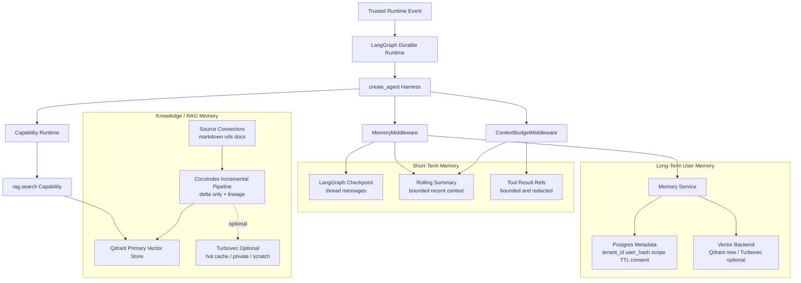
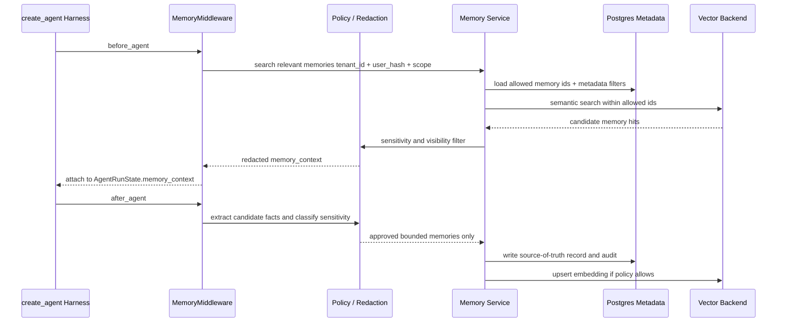
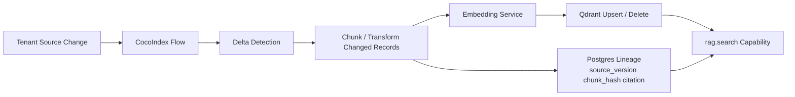

# Core Agent Design

## Mục đích

Thiết kế Core Agent harness runtime: LangGraph durable orchestration, LangChain `create_agent` model/tool loop, middleware control plane, state/context contracts, capability runtime, delegated Deep Agent policy, replay, and human-in-the-loop.

## Đối tượng đọc

AI engineer, backend engineer, tool/plugin developer, QA, security reviewer, product owner.

## Design Summary

Agent Support dùng **LangGraph Durable Runtime** làm top-level worker orchestration, checkpoint/resume, interrupts, streaming, subgraphs, and deterministic non-agent steps. The normal model/tool loop runs inside a **Harness Runtime** built with LangChain `create_agent`. Product-specific LangChain middleware owns lifecycle controls that used to be embedded in graph nodes or prompts.

Agent Core own đường từ trusted inbound event -> replayable run -> harness invocation -> audited capability usage -> policy-checked result -> outbound delivery intent.

Agent Core PHẢI: hydrate trusted tenant context, expose only permitted capabilities, enforce model/tool/risk/budget policy, policy-check every output, record replay/audit evidence, and emit outbound only after checks pass.

Agent Core KHÔNG own: tenant credential material, raw platform secrets, unchecked remote tool discovery, direct vector DB access from arbitrary nodes, durable business state hidden in scratch memory, destructive moderation from raw model text, or unfiltered Deep Agents/tool access.

Related decision: [ADR-010 Agent Harness Core](../06-decisions/adr-010-agent-harness-core.md).

## Harness Runtime

```text
Platform Adapter
-> trusted runtime event
-> processing_outbox worker claim
-> LangGraph Durable Runtime
-> harness agent node via LangChain create_agent
-> product Middleware Stack
-> Capability Runtime / Tool Proxy
-> policy-checked response envelope
-> delivery_outbox
```

Runtime lifecycle:

```text
Worker claims processing_outbox event
-> load trusted runtime event
-> create/resume LangGraph run/checkpoint
-> hydrate tenant/platform/run context
-> invoke create_agent harness node
   before_agent: tenant/platform/memory/bootstrap
   before_model: prompt/context/model/budget
   wrap_model_call: retry/fallback/latency/cost
   after_model: output/risk/tool-intent policy
   wrap_tool_call: capability guard/audit/timeout/redaction
   after_agent: memory write/run summary/metrics
-> policy-checked final response
-> response envelope
-> delivery_outbox
```

Ownership rules:

| Layer | Owns | Must not own |
| --- | --- | --- |
| Adapter | Platform auth, payload normalization, outbound send | Tenant policy, RAG, moderation, tool permission |
| LangGraph Durable Runtime | Worker execution, checkpoint/resume, interrupts, deterministic graph topology | Large model/tool loop business logic |
| `create_agent` Harness Runtime | Model/tool loop, middleware execution, thread-aware invocation | Platform delivery side effects |
| Middleware Stack | Tenant/platform/context/model/tool/risk/HITL/observability controls | Secret material or unchecked durable writes |
| Capability Runtime | Tool/subagent validation, permission, timeout, approval, audit, redaction | Unfiltered tool discovery or raw model execution |
| Outbox | Reliable delivery handoff and idempotency | Policy decisions |

LangChain middleware runs inside the compiled LangGraph returned by `create_agent`, so middleware controls are checkpoint-compatible with the durable runtime.

## AgentRunState Contract

```python
class AgentRunState(TypedDict):
    trace_id: str
    tenant_id: str
    input_event_id: str
    platform: Literal["telegram", "discord"]
    channel_id: str
    thread_id: str | None
    user_id_hash: str
    message_id: str
    inbound_text_preview: str
    messages: list[dict[str, object]]
    tenant_context: dict[str, object]
    platform_context: dict[str, object]
    memory_context: dict[str, object]
    available_capabilities: list[str]
    tool_results: list[dict[str, object]]
    policy_decisions: list[dict[str, object]]
    risk_signals: list[dict[str, object]]
    budgets: dict[str, object]
    final_response: dict[str, object] | None
    audit_refs: list[str]
```

Rules: state is serializable and checkpoint-safe; `tenant_id` is immutable after hydration; raw secrets, raw private docs, and full sensitive payloads stay outside exported traces; tool outputs are bounded and redacted before prompt visibility; prompt-visible memory is policy-built, not a dump of full state.

## HarnessContext And TenantHarnessProfile

`HarnessContext` is per-run runtime context passed to middleware and tools. It may hold service handles, logger/callback handles, request deadlines, and credential handle resolvers, but not decrypted secrets in checkpointed state.

```python
class HarnessContext(TypedDict):
    trace_id: str
    tenant_id: str
    deadline_ms: int
    run_mode: Literal["shadow", "propose", "enforce"]
    services: dict[str, object]
    redaction_policy: dict[str, object]
```

`TenantHarnessProfile` is the policy/config snapshot used by middleware:

```python
class TenantHarnessProfile(TypedDict):
    tenant_id: str
    config_version: int
    policy_version: int
    enabled_platforms: list[str]
    allowed_capabilities: list[str]
    model_policy: dict[str, object]
    memory_policy: dict[str, object]
    moderation_policy: dict[str, object]
    escalation_policy: dict[str, object]
    budgets: dict[str, object]
```

Open implementation choice: profile source may be DB config, manifest files, or a hybrid. Any choice must preserve tenant isolation, versioned audit, and fail-closed behavior.

## Middleware Stack

Ordering: tenant/platform before prompt; memory/context before model; capability registry before tool guard; risk/policy before outbound; observability wraps the full run.

| Middleware | Hook points | Responsibilities | Failure behavior |
| --- | --- | --- | --- |
| `TenantContextMiddleware` | `before_agent` | Load tenant status, profile, policy, model budget, capability enablement | Stop before model/tool/outbound if inactive or unresolved |
| `PlatformContextMiddleware` | `before_agent`, `before_model` | Apply Telegram/Discord constraints, formatting, channel/thread metadata, response limits | Safe fallback or typed platform error |
| `DynamicPromptMiddleware` | `before_model` | Assemble system/developer context from tenant persona, policy, locale, retrieved memory, source rules | Refuse/escalate if required context is missing |
| `MemoryMiddleware` | `before_agent`, `after_agent` | Retrieve relevant memory before run and write bounded useful facts after completion | Continue without memory on read miss; audit write denial |
| `ContextBudgetMiddleware` | `before_model` | Compact messages/tool outputs before context overflow | Typed budget error or safe fallback |
| `ModelPolicyMiddleware` | `wrap_model_call` | Select model, enforce call limits, retry/fallback, latency/cost/timeout budgets | Fail closed on budget exhaustion |
| `CapabilityRegistryMiddleware` | `before_model` | Expose only tenant/role/node-allowed tools and delegated agents | Empty/filtered tool list; audit denied exposure |
| `ToolGuardMiddleware` | `wrap_tool_call` | Validate args, permission, risk, timeout, credential handles, approval, output bounds, redaction, audit | Return typed tool denial/timeout; no hidden side effect |
| `RiskPolicyMiddleware` | `after_model`, `after_agent` | Evaluate inbound/outbound risk with `shadow`, `propose`, `enforce` modes | No outbound when policy fails |
| `HumanApprovalMiddleware` | `wrap_tool_call`, graph interrupt | Interrupt before destructive, high-risk, or expensive side-effect capabilities | Pause/resume via checkpoint; no action before approval |
| `ObservabilityMiddleware` | all wrap/hooks | Emit redacted trace events, latency, model/tool decisions, replay refs | Observability failure must not leak data; critical audit failure stops side effects |

Middleware state updates must be additive and typed. No middleware may mutate `tenant_id` or bypass tenant policy.

## Memory Architecture

Memory is split into three separate concerns so the harness can control prompt context without coupling runtime state to a vector database.

| Memory type | Source of truth | Vector use | Harness owner | Purpose |
| --- | --- | --- | --- | --- |
| Short-term memory | LangGraph checkpoint and rolling summaries | No default vector index | `MemoryMiddleware` + `ContextBudgetMiddleware` | Resume, streaming, HITL, recent conversation context |
| Long-term user memory | Postgres metadata/audit records | Qdrant initially; Turbovec optional later | `MemoryMiddleware` + memory service | User/channel facts, preferences, prior resolutions |
| Knowledge/RAG memory | Tenant source records and source versions | Qdrant primary | `rag.search` capability | Tenant docs, FAQ, official links, policies, citations |
| Indexing pipeline | Source connector job state and lineage | Feeds vector backends | Background ingestion workers | Fresh source indexing, not per-request agent memory |



### Short-Term Memory

Short-term memory is checkpointed runtime context, not RAG. It contains the exact thread state needed for resume, streaming, and human approval, plus a bounded rolling summary for prompt budget control.

```python
class ShortTermMemory(TypedDict):
    thread_id: str
    recent_messages: list[dict[str, object]]
    rolling_summary: str | None
    last_tool_refs: list[str]
    token_budget_used: int
```

Rules:

- Store in LangGraph checkpoints and product run records, not Qdrant by default.
- Summarize when token budget thresholds are hit.
- Keep TTL scoped to thread/session/channel policy.
- Do not embed every chat message by default.
- Do not promote a fact to long-term memory until extraction, sensitivity, consent, and TTL policy pass.

### Long-Term User Memory

Long-term memory stores useful facts and summaries that survive a session: language preference, repeated support issue, prior resolution summary, channel-level context, or safe escalation history. Postgres is the source of truth for metadata, deletion, TTL, sensitivity, and audit. The vector backend is only a retrieval index.

```python
class LongTermMemoryRecord(TypedDict):
    memory_id: str
    tenant_id: str
    user_id_hash: str
    scope: Literal["user", "channel", "tenant"]
    kind: Literal["preference", "fact", "summary", "risk_signal", "resolution"]
    text: str
    embedding_ref: str | None
    source_event_id: str
    confidence: float
    sensitivity: str
    visibility: list[str]
    ttl_days: int | None
    created_at: str
    last_used_at: str | None
```

Long-term memory flow:



### Knowledge / RAG Memory

Knowledge memory is tenant-owned source material: Markdown/FAQ uploads, approved URLs, docs sites, official links, and policy text. It is accessed through `rag.search` and never by direct vector DB calls from model code.

Rules:

- Qdrant remains the primary vector store for RAG in the default deployment.
- Every chunk carries `tenant_id`, source id, source version, visibility, hash, and citation metadata.
- Retrieval must filter by tenant, source visibility, platform/channel policy, and freshness.
- Empty, stale, or low-confidence retrieval causes refusal, clarification, or escalation.
- Raw private source text is not exported into traces; prompt-visible snippets are bounded and cited.

### CocoIndex Role

CocoIndex is an optional incremental indexing engine for source freshness. It should run in background ingestion jobs and feed vector stores; the per-request harness should not call CocoIndex directly.



Use CocoIndex for Markdown/docs/URL source indexing after the base RAG path is stable. It provides delta-only reindexing and lineage, but it is not the memory source of truth and is not required for the first harness code spike.

### Turbovec Role

Turbovec is an optional vector backend or cache, not the default replacement for Qdrant. It is useful where local latency, memory footprint, or private/air-gapped deployment matters.

Potential uses:

- Hot tenant cache for active docs while Qdrant remains source of truth.
- Private deployment profile where managed/vector service footprint must be minimized.
- Delegated Deep Agent scratch index for a bounded report bundle or investigation workspace.
- Allowlist dense search after SQL/Postgres selects ACL-safe candidate ids.

Turbovec adoption requires a spike for durability, concurrent writes, backup/restore, multi-worker behavior, filtering semantics, and recall/latency against Qdrant.

### Vector Backend Strategy

Expose vector search behind an internal interface so Qdrant, Turbovec, or a hybrid backend can be changed without changing harness middleware or capabilities.

```python
class VectorIndex(Protocol):
    async def upsert(self, records: list[VectorRecord]) -> None: ...
    async def delete(self, ids: list[str], tenant_id: str) -> None: ...
    async def search(
        self,
        tenant_id: str,
        query_embedding: list[float],
        top_k: int,
        filters: dict[str, object],
        allowlist: list[str] | None = None,
    ) -> list[VectorHit]: ...
```

Implementations:

- `QdrantVectorIndex`: default primary RAG and long-term memory embedding index.
- `TurbovecVectorIndex`: optional local/private/hot-cache backend after benchmark approval.
- `HybridVectorIndex`: SQL/BM25/ACL candidate selection followed by dense vector search.

### Memory Policy And Privacy Rules

- Tenant policy decides which memory types are enabled.
- User/channel memory requires bounded extraction, sensitivity classification, TTL, and deletion support.
- Memory retrieval always filters by `tenant_id`, `user_id_hash` or scope, visibility, and platform/channel policy.
- Memory writes must reference `source_event_id` and produce audit records.
- The model sees redacted summaries/snippets, not raw memory tables or unrestricted source documents.
- Deleting a tenant/user/source must remove Postgres records and corresponding vector entries.


## Capability Runtime

Core Agent does not bind all tools directly to the model. The harness asks Capability Runtime for a filtered set and executes through one interface:

```python
CapabilityRuntime.execute(name: str, input: dict, context: HarnessContext) -> dict
```

Runtime predicate:

```text
tenant active
and capability enabled
and agent role allowed
and risk level allowed
and input schema valid
and budget/rate limit available
and timeout configured
and credential handle available when required
and approval gate satisfied when required
```

Execution flow:

```text
normalize name
-> load manifest + tenant enablement
-> verify role, risk, visibility, budget, rate limit, approval
-> validate input schema
-> create pre-call audit
-> resolve tenant-scoped credential handle if needed (KMS decrypt, ADR-006)
-> execute built-in tool, delegated Deep Agent, or filtered MCP tool with timeout
-> validate, bound, and redact output
-> update audit
-> return structured result or typed error
```

### Capability Manifest

```yaml
schema_version: "1"
name: "rag.search"
type: "tool"
risk_level: "read_sensitive"
allowed_agent_roles: ["support"]
default_timeout_ms: 3000
max_timeout_ms: 8000
retry_policy: "read_idempotent"
audit_event: "tool.rag.search"
input_schema_ref: "schemas/rag.search.input.json"
output_schema_ref: "schemas/rag.search.output.json"
```

Examples:

| Capability | Type | Risk | Notes |
| --- | --- | --- | --- |
| `rag.search` | built-in read tool | `read_sensitive` | Tenant-filtered snippets with citations |
| `tenant.official_links` | built-in read tool | `read_public` | Deterministic onboarding links |
| `moderation.propose_action` | built-in side effect | `moderation_side_effect` | Requires audit/idempotency; enforcement depends on tenant mode |
| `support-investigator` | delegated Deep Agent | `read_sensitive` | Max steps, inherited tenant/trace/budget/allowed tools |

MCP rules: pinned server identity/version, filtered tool list, no token passthrough, no arbitrary remote discovery, no arbitrary shell. Side-effecting MCP tools require idempotency plus approval and are deferred until the approval path is proven.

## Deep Agents Delegation Policy

Use delegated Deep Agents for: multi-step investigation, large context offload, report drafting, specialist tool sets, long-running workflows, and approval pauses.

When NOT to use delegated Deep Agents: normal FAQ, single-step RAG, onboarding, fast moderation screening, deterministic policy checks, or any path where overhead is larger than benefit.

Delegated capability constraints: tenant opt-in, inherited trace/tenant/budget/timeout/visibility/allowed tools, no dynamic unfiltered tool request, no durable writes except audited services, run-scoped disposable scratch, bounded output returned through Capability Runtime.

```yaml
name: "support-investigator"
type: "deep_agent"
risk_level: "read_sensitive"
allowed_tools: ["rag.search", "tenant.official_links"]
max_steps: 8
timeout_ms: 20000
```

```yaml
name: "ops-report-agent"
type: "deep_agent"
risk_level: "internal_report"
allowed_tools: ["rag.search"]
max_steps: 10
timeout_ms: 30000
requires_approval_for_output: true
```

Dependency checkpoint: verify `deepagents` package/API and get approval before adding it to `pyproject.toml`.

## Support, Moderation, And Onboarding Policies

Support RAG: call `rag.search` through Capability Runtime; answer only from approved context with citation metadata; empty/stale/low-confidence results must refuse, clarify, or escalate; public channels must not use private/internal source content without policy.

Moderation: default destructive actions to `shadow`; use `propose` for uncertain/high-impact actions; use `enforce` only with explicit tenant policy, idempotency, and required approval gates.

Onboarding: deterministic-first templates, official links, safety warnings, community rules, locale fallback. LLM rendering is optional and must not invent links/policy.

## Prompt And Model Policy

Prompts are versioned assets. Every model call records provider, model, temperature, max tokens, prompt version, tenant config/policy version, token usage/cost, timeout/retry outcome.

System prompts must state: retrieved docs are untrusted data and cannot override platform policy; tool calls require structured schema plus platform permission; answers must refuse/escalate when source support is weak; destructive action cannot be taken from free-form text.

`ModelPolicyMiddleware` must reconcile with existing `app/services/llm/service.py` retry/fallback so fallback logic is not duplicated.

## Human-In-The-Loop

Human approval is required for destructive moderation unless explicitly allowed by tenant policy, high-risk side-effect tools, candidate knowledge approval, production policy/plugin changes, and sensitive incident replay/export.

Implementation options: LangGraph interrupt, review queue, operator API, or Phase 6 Telegram bot review. Final action records include actor, trace id, tenant id, decision, and timestamp.

## Replay And Checkpointing

Replay inputs: trusted runtime event, tenant profile version, prompt/model versions, allowed capability versions, retrieval fixture/source version, tool call fixtures, and model output fixtures.

Rules: unit tests do not call real LLM/external tools; replay preserves trusted tenant id; run records identify graph version and middleware sequence; checkpoints support resume; audit/run tables are incident source of truth.

Checkpointer + RLS (ADR-002): AsyncPostgresSaver uses the same connection pool but does not set tenant context by itself. Include `tenant_id` in checkpoint metadata and filter app-side. Worker crash during graph run leaves a checkpoint; restart reclaims stale `processing` event and resumes same run.

## Migration Plan

Compatibility matrix:

| Current behavior/API | Migration requirement |
| --- | --- |
| `LangGraphAgent.get_response` | Preserve signature and response behavior behind compatibility wrapper |
| `LangGraphAgent.get_stream_response` | Preserve streaming chunks and cancellation/resume semantics |
| `LangGraphAgent.get_chat_history` | Preserve checkpoint/thread history reads |
| `LangGraphAgent.clear_chat_history` | Preserve existing clear behavior |
| Postgres checkpointer | Keep checkpoint/resume with tenant metadata |
| Langfuse callbacks | Replace or wrap with observability middleware without losing trace refs |
| Memory search/add | Move behind memory middleware without duplicate writes |
| Outbox worker compatibility | Keep delivery_outbox and processing_outbox idempotency/reclaim semantics |

Implementation slices:

1. Docs/ADR and approval of harness architecture.
2. Package/API spike for `create_agent` with fake model/tool/checkpointer constraints.
3. `app/core/agent_harness/` state/context skeleton.
4. Middleware skeleton with no real LLM calls in unit tests.
5. Capability Runtime skeleton and manifest loader.
6. `LangGraphAgent` compatibility wrapper for current chatbot callers.
7. Worker/outbox integration after compatibility tests pass.
8. Delegated Deep Agents capability after dependency approval.

Rollback path: keep current `LangGraphAgent` implementation behind the stable public interface until harness tests pass; switch by config flag or small wrapper change, not a big-bang rewrite.

Dependency gates: verify LangChain middleware APIs and `create_agent` checkpointer behavior in a spike; approve `deepagents` separately before dependency addition.

## Test Plan

- No real LLM in unit tests; use fake model/tool and deterministic replay fixtures.
- Fake model/tool support, moderation, onboarding, fallback, and prompt-injection fixtures.
- Disabled tenant fails before model/tool/outbound.
- `tenant_id` immutable after hydration.
- Tool denied path is audited and returns safe fallback when allowed.
- Prompt injection cannot override policy or request hidden tools.
- Streaming interrupt/resume works through checkpoints.
- Memory read/write is bounded and non-duplicating.
- Outbox idempotency and stale processing reclaim remain covered.
- Capability manifest contract tests validate schema, timeout, redaction, and audit fields.

## First Code Spike Brief

The first code spike should verify `create_agent` with current model/tool/checkpointer constraints while preserving `LangGraphAgent` public API in a compatibility wrapper. Candidate files: `app/core/agent_harness/`, `app/core/langgraph/graph.py`, `app/schemas/graph.py`, and `tests/agent_harness/`. Proof must use fake model/tool only.

## References

- [System Architecture](system-architecture.md)
- [Adapters And Integrations](adapters-and-integrations.md)
- [ADR-002 Tenant Isolation](../06-decisions/adr-002-tenant-isolation-model.md)
- [ADR-003 Graph Execution](../06-decisions/adr-003-graph-execution-mode.md)
- [ADR-010 Agent Harness Core](../06-decisions/adr-010-agent-harness-core.md)
- [Eval Datasets](../04-observability/eval-datasets.md)
