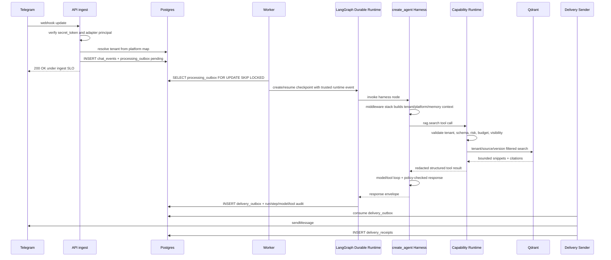
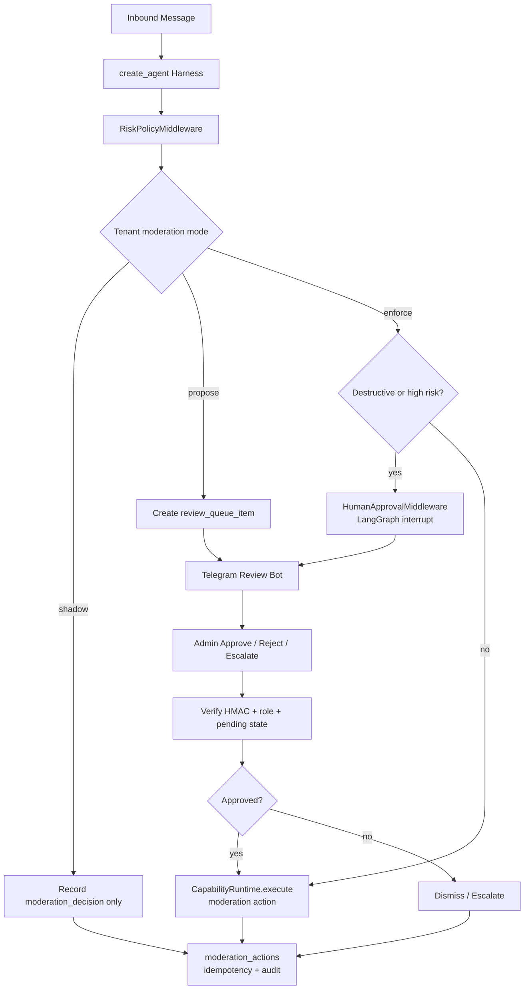
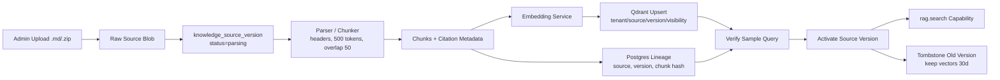
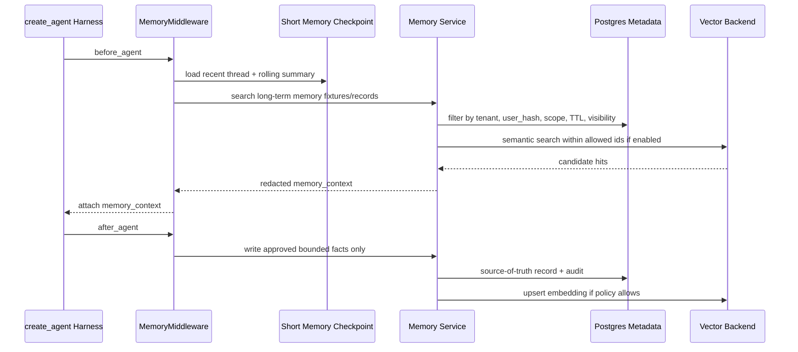

# Data Flow Diagrams

Sequence diagrams per use case. Text-based diagrams are kept in git for review.

## 1. Support Message (Telegram -> Answer)



Idempotency: duplicate update -> `chat_events` unique key returns existing event id and does not create a duplicate run.

## 2. Moderation (Shadow / Propose / Enforce)



No destructive action may execute directly from raw model text. Review UI Phase 6 = Telegram bot + minimal API.

## 3. Knowledge Sync (Markdown Upload, Phase 4)



Failure leaves the source version in parsing/verifying state; partial sync is never visible. CocoIndex may later replace the parser/index job with delta-only indexing, but `rag.search` stays the harness-facing capability.

## 4. Memory Retrieval And Writeback



Short-term memory remains checkpoint-backed. Qdrant is the default long-term memory embedding index if enabled; Turbovec is optional after a backend spike.

## 5. Tenant Onboarding (Admin Setup)

```text
user signup/login (JWT)
-> create tenant (status=active) + tenant_memberships(user, tenant, role=admin)
-> tenant_config_versions v1 (persona, official_links, moderation_mode, model_budget)
-> Telegram setup: BotFather token -> KMS encrypt -> tenant_platforms + credential handle
-> setWebhook(secret_token)
-> add bot to group -> my_chat_member event -> confirm channel mapping
-> upload knowledge source (Phase 4)
-> enable capabilities (rag.search default; other tools opt-in)
-> audit_events for every mutation (actor, trace_id, before/after, config_version)
```

## 6. Incident Replay (Operator)

```text
operator input: trace_id | platform message_id | agent_run_id
-> operator role (BYPASSRLS) + audit access
-> load chat_events + agent_runs + agent_run_steps
-> load middleware sequence + model_calls + tool_calls + retrieval summaries
-> load tenant config/policy/source/capability versions @ run time
-> replay harness with fake model/tool outputs (deterministic)
-> classify root cause: retrieval | prompt | model | policy | capability | adapter | auth | data
-> patch + add regression fixture
-> record incident note + operator actions (audit_events)
```

## 7. Secret Resolution (KMS Envelope, ADR-006)

```text
CapabilityRuntime.execute(tool requiring credential)
-> load capability manifest + tenant enablement
-> load tenant_credential_handle
-> KMS decrypt in service boundary only
-> call provider with timeout
-> redact provider response/error
-> discard plaintext secret
-> audit handle id/version, never secret value
```
