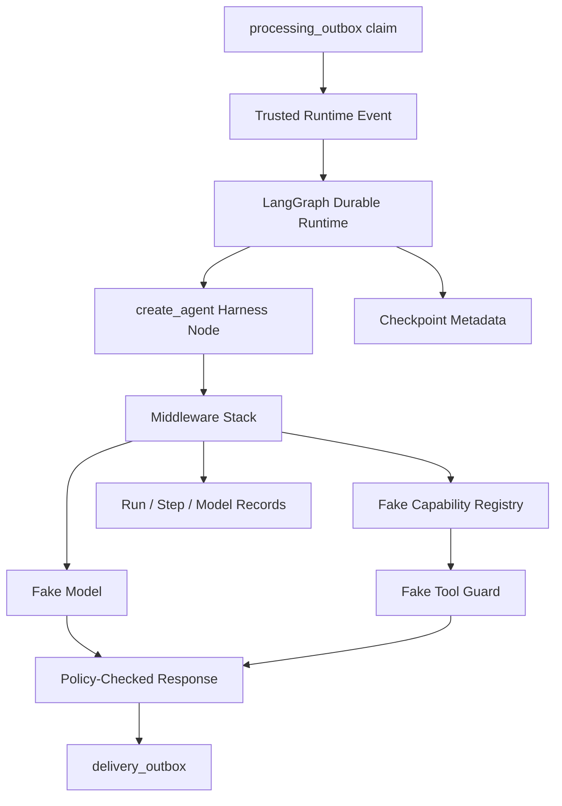

# Phase 3: Harness Runtime Skeleton

**Goal:** replace the generic chat loop with a replayable harness runtime that runs in the worker: LangGraph remains the durable runtime, LangChain `create_agent` owns the model/tool loop, and middleware owns lifecycle controls.

## Scope

- `AgentRunState`, `HarnessContext`, and `TenantHarnessProfile` skeletons from [Core Agent Design](../01-architecture/core-agent-design.md).
- LangGraph Durable Runtime wrapper for worker execution, checkpoint/resume, streaming, and interrupts.
- `create_agent` harness node with fake model and fake tools only.
- Initial middleware skeletons: tenant context, platform context, dynamic prompt, memory, context budget, model policy, capability registry, tool guard, risk policy, human approval, observability.
- `LangGraphAgent` compatibility wrapper preserving `get_response`, `get_stream_response`, `get_chat_history`, and `clear_chat_history`.
- Run records: `agent_runs`, `agent_run_steps`, `model_calls`, `graph_checkpoint_metadata`.
- Short-term memory via checkpoints and rolling summaries; fake long-term memory fixtures only.
- Safe fallback, policy-checked outbound envelope, replay tests.

## Deliverables

### Harness Runtime

```text
processing_outbox worker claim
-> trusted runtime event
-> LangGraph Durable Runtime checkpoint/resume
-> create_agent harness node
-> middleware stack
-> fake model/tool loop
-> policy-checked response envelope
-> delivery_outbox
```



### Middleware Skeleton

- `TenantContextMiddleware`: load tenant status/profile; disabled tenant stops before model/tool/outbound.
- `PlatformContextMiddleware`: apply Telegram/Discord-safe response limits.
- `DynamicPromptMiddleware`: assemble prompt from tenant/platform/memory fixtures.
- `MemoryMiddleware`: load checkpoint-backed short-term memory and fake long-term memory fixtures.
- `ContextBudgetMiddleware`: compact messages/tool outputs before context overflow.
- `ModelPolicyMiddleware`: fake model selection, call limits, timeouts, cost counters.
- `CapabilityRegistryMiddleware`: expose only fake capabilities allowed by tenant profile.
- `ToolGuardMiddleware`: schema/permission/timeout/audit around fake tool calls.
- `RiskPolicyMiddleware`: shadow/propose/enforce state machine, no destructive side effects.
- `HumanApprovalMiddleware`: interrupt/pause placeholder for later moderation/tools.
- `ObservabilityMiddleware`: redacted trace/run metadata.

### Run Records

- `agent_runs`: trace, event, harness version, middleware sequence, config/policy version, status, latency.
- `agent_run_steps`: middleware/tool/model step, status, latency, redacted summary.
- `model_calls`: provider/model/prompt version/cost/tokens, mocked in Phase 3.
- `graph_checkpoint_metadata`: thread_id -> tenant_id, RLS-aware, ADR-002.
- Runtime guardrails: max wall time, max retries, max prompt-visible state size, max tool/model calls, worker concurrency.

### Mock Interfaces

- `rag.search` fake capability; real Qdrant arrives in Phase 4.
- Fake model responses for deterministic unit tests; no real LLM.
- Fake memory service fixtures; no Qdrant, CocoIndex, or Turbovec dependencies in Phase 3.

## Safety

- Disabled tenant stops before harness model/tool/outbound, record denied run.
- `tenant_id` immutable after hydration.
- Outbound only after policy check.
- Model never receives global tool list; only filtered fake capabilities.
- Short-term memory remains checkpoint-backed; no automatic promotion into long-term memory.

## Exit Criteria

- [ ] Saved trusted event replays with mocked outputs are deterministic.
- [ ] `tenant_id` immutable.
- [ ] No real LLM in unit tests.
- [ ] Outbound only after policy-checked response envelope.
- [ ] Run/step/model records created.
- [ ] Checkpoint resume works after worker crash simulation.
- [ ] Disabled tenant fails before harness model/tool/outbound.
- [ ] `LangGraphAgent` public methods remain compatible.
- [ ] Fake tool denial is audited and never calls underlying tool.

## Validation

```bash
pytest tests/agent_harness
pytest tests/agent_harness/replay
pytest tests/agent_harness/compatibility
```

Replay test: same trusted event + tenant profile + fake model/tool fixtures -> same middleware sequence + same output.

## Risks

| Risk | Mitigation |
| --- | --- |
| Checkpointer bypasses RLS | Include `tenant_id` in checkpoint metadata + app-side filter (ADR-002). |
| Harness leaks raw private data to traces | Bounded state + redaction tests. |
| Generic chat loop ships accidentally | Compatibility wrapper delegates to harness; fake model/tool tests enforce path. |
| Runtime overload | Per-run timeout/budget and worker concurrency below DB pool/Compose caps. |
| Middleware API mismatch | Phase 3 is an API spike before real tools/dependencies. |

## References

- [Core Agent Design](../01-architecture/core-agent-design.md)
- [ADR-010 Agent Harness Core](../06-decisions/adr-010-agent-harness-core.md)
- [ADR-003 Graph Execution](../06-decisions/adr-003-graph-execution-mode.md)
- [Eval Datasets (Phase 3 focus)](../04-observability/eval-datasets.md)
