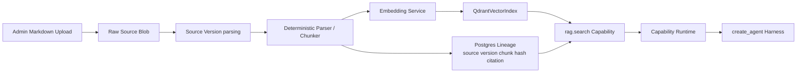

# Phase 4: Knowledge, RAG, And Memory Indexing

**Goal:** answer from approved tenant knowledge through `rag.search`, with Qdrant as the primary vector store and the harness calling retrieval only through Capability Runtime.

## Scope

- Knowledge schema: sources, versions, documents, chunks, sync jobs, candidates, ingest audit, lineage.
- Markdown upload + deterministic parser/chunker (500 tokens / 50 overlap).
- `VectorIndex` / `VectorSearchProvider` contract with `QdrantVectorIndex` default implementation.
- Real `rag.search` built-in capability, replacing Phase 3 fake capability.
- Citation builder, refusal policy, stale/low-confidence policy.
- Source version activation with no partial visibility.
- Long-term user memory metadata model and Qdrant-backed retrieval index if memory policy enables it.
- CocoIndex and Turbovec remain design/spike items only; no required dependency in the base Phase 4 path.

## Pipeline

```text
upload .md/.zip
-> raw blob
-> source_version(parsing)
-> parse by headers
-> documents
-> chunks with citation metadata
-> embed
-> Qdrant upsert with tenant/source/version/visibility payload
-> verify sample query
-> activate source version
-> tombstone old chunks (keep 30d)
```



Detail: [Vector And RAG Storage](../02-persistence/vector-and-rag-storage.md) and [Core Agent Design Memory Architecture](../01-architecture/core-agent-design.md#memory-architecture).

## Harness Integration

- The model cannot call Qdrant directly.
- `CapabilityRegistryMiddleware` exposes `rag.search` only when tenant/source policy allows it.
- `ToolGuardMiddleware` validates input, tenant visibility, timeout, output bounds, redaction, and audit.
- `DynamicPromptMiddleware` receives only bounded cited snippets.
- Empty/stale/low-confidence retrieval refuses, clarifies, or escalates.

## Memory Integration

- Short-term memory stays in LangGraph checkpoints and rolling summaries.
- Long-term memory metadata lives in Postgres; embeddings may be indexed in Qdrant behind memory service.
- Memory retrieval must filter by `tenant_id`, `user_id_hash` or scope, visibility, and platform/channel policy.
- Memory deletion removes Postgres records and vector entries.

## Resource Guardrails

- Add env-configurable ingest batch size, embedding concurrency, Qdrant upsert batch size, max active source syncs per tenant, and retrieval top-k limits.
- Keep Qdrant container caps from Phase 0 unless benchmark data proves they are too low.
- Tenant filter correctness remains the release gate because Qdrant has no RLS.
- Prompt-visible snippets and memory hits must be bounded and redacted before traces.

## Exit Criteria

- [ ] Tenant A cannot retrieve Tenant B chunks through `rag.search`.
- [ ] Empty/stale/low-confidence retrieval refuses, clarifies, or escalates.
- [ ] Source update/delete/tombstone hides old chunks.
- [ ] Source version activation prevents partial sync visibility.
- [ ] Answers include citation metadata.
- [ ] `rag.search` tool calls are audited by Capability Runtime.
- [ ] Memory retrieval respects tenant/user/scope/visibility filters if enabled.

## Validation

```bash
pytest tests/rag
pytest tests/agent_harness/test_rag_capability.py
pytest tests/memory/test_memory_policy.py
```

## Notes

- URL allowlist remains Phase 5 and reuses the Markdown intermediate pipeline.
- CocoIndex is a later incremental indexing engine for freshness/lineage; it feeds Qdrant but is not called per request.
- Turbovec is a later optional local/hot/private vector backend; it does not replace Qdrant in the default Phase 4 path.
- GitBook/Drive defer until credential handles and ACL mapping are proven.

## References

- [ADR-001 Vector Backend](../06-decisions/adr-001-vector-backend.md)
- [ADR-010 Agent Harness Core](../06-decisions/adr-010-agent-harness-core.md)
- [Vector And RAG Storage](../02-persistence/vector-and-rag-storage.md)
- [Core Agent Design](../01-architecture/core-agent-design.md)
- [Eval Datasets (Phase 4 focus)](../04-observability/eval-datasets.md)
