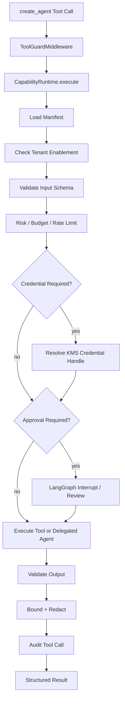

# Phase 5: Capability Runtime, Tools, And Source Connectors

**Goal:** make tools, delegated agents, and new source connectors safe, tenant-configurable, and mediated by Capability Runtime. Secret resolution uses KMS handles (ADR-006).

## Scope

- Capability manifest schema + registry (`plugin_manifests`, `plugin_capabilities`).
- Tenant capability enablement (`tenant_capability_enablement`, `tenant_tool_policies`).
- `CapabilityRuntime.execute(name, input, context)` implementation from [Core Agent Design](../01-architecture/core-agent-design.md).
- `CapabilityRegistryMiddleware` and `ToolGuardMiddleware` wired to real registry/audit records.
- Tool audit records (`tool_calls`).
- Secret handle resolution via KMS envelope and `tenant_credential_handles`.
- Built-in capabilities: `rag.search`, `tenant.official_links`, `moderation.propose_action`, `support.escalate`.
- URL allowlist knowledge source using the Phase 4 Markdown intermediate pipeline.
- Optional spikes for CocoIndex incremental indexing and Turbovec backend/cache; dependency additions require approval.

## Capability Runtime Flow



## Runtime Predicate

```text
tenant active AND capability enabled AND role allowed AND risk allowed
AND input schema valid AND budget/rate limit available AND timeout configured
AND credential handle available if required AND approval satisfied if required
```

Denied calls return typed errors plus audit records and never call the underlying tool.

## Manifest Example

```yaml
schema_version: "1"
name: "rag.search"
type: "tool"
risk_level: "read_sensitive"
allowed_agent_roles: ["support"]
default_timeout_ms: 3000
max_timeout_ms: 8000
retry_policy: "read_idempotent"
audit_event: "tool.rag.search"
input_schema_ref: "schemas/rag.search.input.json"
output_schema_ref: "schemas/rag.search.output.json"
```

## Tool And Source Connector Notes

- `rag.search` remains the primary RAG capability and continues to use Qdrant by default.
- URL allowlist source connector must enforce domain allowlist, fetch policy, content bounds, malware/content-type checks, and source approval before activation.
- CocoIndex can be spiked as the incremental indexing engine for Markdown/URL/docs freshness and lineage; it feeds Qdrant and is not called from the per-request harness.
- Turbovec can be spiked as an optional `VectorIndex` backend for hot cache, private deployment, allowlist rerank, or delegated Deep Agent scratch index.
- MCP read tools (`crypto.price`, `web.search`) are tenant-enabled only, with pinned server identity/version, no token passthrough, and egress controls.
- Side-effecting tools require idempotency, approval, timeout, audit, and rollback/compensation notes.

## Exit Criteria

- [ ] Disabled capability cannot execute.
- [ ] Tool input/output schemas enforced.
- [ ] Tool denials audited.
- [ ] Secrets absent from logs/traces/config.
- [ ] Missing credential fails closed with `TOOL_CREDENTIAL_UNAVAILABLE`.
- [ ] URL allowlist source connector cannot fetch outside approved domains.
- [ ] Capability Runtime exposes only filtered tools to the model.
- [ ] CocoIndex/Turbovec remain behind explicit spike/dependency gates unless approved.

## Validation

```bash
pytest tests/capabilities
pytest tests/tools
pytest tests/source_connectors/test_url_allowlist.py
pytest tests/agent_harness/test_tool_guard.py
```

## Risks

| Risk | Mitigation |
| --- | --- |
| Tool surface creep | Manifest allowlist + tenant enablement + filtered exposure. |
| Secret leakage | Credential handles only; redaction tests; no token passthrough. |
| MCP remote tool risk | Pin server identity/version; no arbitrary discovery; egress controls. |
| Source connector poisoning | Domain allowlist, approval workflow, citation/version lineage. |
| Premature backend churn | Qdrant default; CocoIndex/Turbovec require separate spike proof. |

## References

- [ADR-006 Secret Manager](../06-decisions/adr-006-secret-manager.md)
- [ADR-010 Agent Harness Core](../06-decisions/adr-010-agent-harness-core.md)
- [Secret Handling](../03-security/secret-handling.md)
- [Core Agent Design](../01-architecture/core-agent-design.md)
