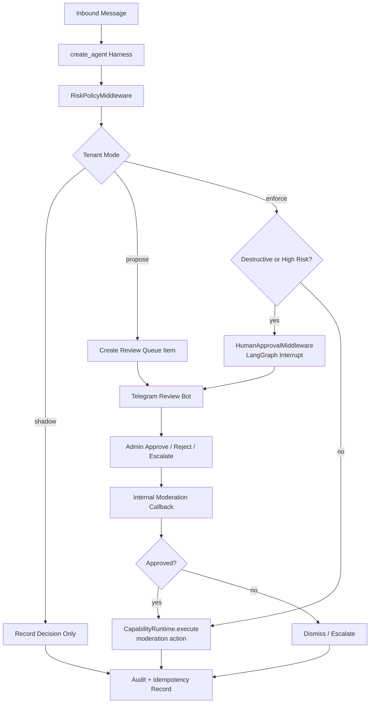

# Phase 6: Moderation Enforcement, HITL, And Review

**Goal:** move from risk detection to controlled action through harness policy, Capability Runtime, and human approval. Review UI = Telegram bot review + minimal API (Decision 12); web UI defers to Phase 7+.

## Scope

- Policy matrix by category/action (`policy_versions`).
- `RiskPolicyMiddleware` enforcement of `shadow`, `propose`, and `enforce` modes.
- `HumanApprovalMiddleware` using LangGraph interrupts for destructive/high-risk/expensive side effects.
- Review queue (`review_queue_items`).
- Moderation records (`moderation_decisions`, `moderation_actions`).
- Platform moderation action capabilities: delete, ban, mute, warn; all idempotent and audited.
- Telegram bot review channel with inline keyboard.
- False positive/negative regression set and prompt-injection fixtures.

## Harness Moderation Flow



## Telegram Bot Review Flow

```text
RiskPolicyMiddleware(mode=propose)
-> moderation_decisions(pending)
-> worker post to tenant.review_chat_id with inline keyboard [Approve][Reject][Escalate]
-> admin tap -> callback_data {decision_id, action, hmac}
-> /v1/internal/moderation/callback
-> verify hmac + role (tenant_memberships) + decision pending
-> approve -> CapabilityRuntime.execute(moderation action)
-> reject -> dismissed
-> escalate -> needs_review
-> audit who/when/before/after
-> edit Telegram review message with outcome
```

Minimal API: `GET /v1/admin/moderation/queue`, `POST /v1/admin/moderation/{id}/decision`. Web UI Phase 7 is only a presentation layer over the same API.

## Safety Rules

- No model text executes destructive action directly.
- Destructive actions require explicit tenant policy, idempotency key, audit, and approval unless a narrowly scoped enforce rule allows automation.
- `ToolGuardMiddleware` validates platform permission, capability risk, schema, timeout, and credentials before action.
- Moderation action output is bounded/redacted before prompt visibility.
- Every review decision records actor, tenant, trace id, reason, before/after state, and timestamp.

## Exit Criteria

- [ ] Shadow/propose/enforce modes behave as configured.
- [ ] Destructive actions are audited and idempotent.
- [ ] Review override works through Telegram bot and minimal API.
- [ ] No model text executes destructive action directly.
- [ ] LangGraph interrupt/resume works for approval pauses.
- [ ] Denied moderation capability returns typed error and does not call adapter/platform.

## Validation

```bash
pytest tests/moderation
pytest tests/agent_harness/test_human_approval.py
pytest tests/capabilities/test_moderation_actions.py
```

## Risks

| Risk | Mitigation |
| --- | --- |
| Admin Telegram account compromise -> fake approve | HMAC signature + 2FA admin login + role verify + rate limit. |
| Destructive action double-executes | Idempotency key UNIQUE and platform receipt tracking. |
| Prompt injection requests moderation bypass | RiskPolicy + ToolGuard ignore untrusted instructions. |
| Approval pause loses state | LangGraph checkpoint/resume release gate. |

## References

- [Security And Auditability](../03-security/security-and-auditability.md)
- [Core Agent Design](../01-architecture/core-agent-design.md)
- [ADR-010 Agent Harness Core](../06-decisions/adr-010-agent-harness-core.md)
- [Eval Datasets (Phase 6 focus)](../04-observability/eval-datasets.md)
