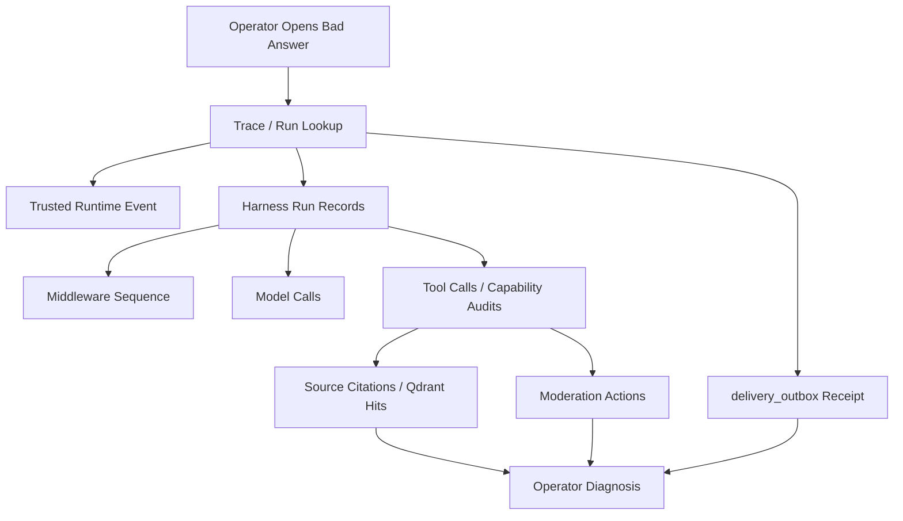

# Phase 7: Discord, Ops, Reports, Dashboard, And Scale

**Goal:** expand operations after the Telegram harness path is safe. Discord remains deferred here (Decision 11), but the contract has been Discord-ready since Phase 2.

## Scope

- Discord adapter reusing normalized contracts and trusted runtime events.
- Harness-aware trace/run inspection APIs for operator debugging.
- Sync retry APIs and source indexing operations.
- Reports + scheduled summaries, potentially using delegated Deep Agent capabilities after approval.
- Cost/latency dashboards for model calls, middleware steps, tools, vector search, Qdrant, and outbox queues.
- Operator runbooks (see [runbooks.md](../04-observability/runbooks.md)).
- Web UI for moderation review as a presentation layer over the Phase 6 API.
- Declarative partitioning by month for `chat_events` when scale triggers are met.
- OAuth/SSO admin login.
- Optional production decision for CocoIndex and/or Turbovec if prior spikes pass.

## Discord Adapter

Contract is ready from Phase 2. Phase 7 builds the real implementation:

- Gateway vs interactions/webhook mode.
- Message content privileged intent enrollment.
- Guild/channel/thread mapping.
- Bot permissions by action type.
- Reconnect/resume strategy.
- Slash commands/admin actions.
- Discord formatting + length constraints.

Reuse: normalized inbound contract, trusted tenant resolution, Core Agent harness boundary, outbound envelope, moderation policy matrix, and Capability Runtime action checks.

> Promote earlier to Phase 5 only if >=30% pilot prospects require Discord.

## Ops Inspection Flow

## Reports And Delegated Agents

Reports may use delegated Deep Agent capabilities only after the dependency/API gate is approved. Delegated report agents must inherit tenant, trace, budget, timeout, visibility, and allowed tools from Capability Runtime.

Examples:

- Weekly support summary.
- Source freshness report.
- Moderation action review.
- Cost/latency anomaly report.

No delegated report agent may write durable business state except through audited services.

## Vector And Indexing Ops

- Qdrant remains the default vector store unless a later ADR changes it.
- CocoIndex can be promoted from spike to production indexing engine for source freshness and lineage if ops/retry/observability are proven.
- Turbovec can be promoted as local hot cache/private backend/scratch index only after durability, backup/restore, concurrent writes, filtering, and recall/latency benchmarks pass.
- Operator APIs should expose source sync status, vector index health, stale source warnings, and failed ingestion jobs.

## Exit Criteria

- [ ] Discord reuses normalized contracts with no harness/core rewrite.
- [ ] Operator debugs bad answer from trace -> runtime event -> middleware -> model -> sources -> tools -> actions.
- [ ] Dashboard/API supports core admin ops without DB access.
- [ ] Reports are generated through approved capabilities and audited.
- [ ] Source/vector sync failures are visible and retryable.

## Migration Triggers (ADR-008)

Lift VPS -> managed when: >20 tenants, enterprise SLA HA, Postgres >50GB, or VPS >70% capacity. Partition `chat_events`; consider managed Postgres (Neon/Supabase), worker scale (Swarm/Fly.io/Cloud Run), and managed/isolated vector infrastructure.

## Resource And Ops Follow-Up

- Review every `*_CPU_LIMIT`, `*_MEM_LIMIT`, Prometheus retention, and Docker log rotation value against 7-day pilot metrics before production launch.
- If Langfuse self-host remains enabled, size ClickHouse from real trace volume or move tracing to Langfuse Cloud/managed ClickHouse before raising app concurrency.
- Add alerts for container memory >70%, Prometheus retention truncation, queue age, DB connection saturation, Qdrant latency, vector sync lag, and Langfuse ingestion lag.

## References

- [ADR-008 Deployment Target](../06-decisions/adr-008-deployment-target.md)
- [ADR-010 Agent Harness Core](../06-decisions/adr-010-agent-harness-core.md)
- [Adapters And Integrations](../01-architecture/adapters-and-integrations.md)
- [Operator API](../api-reference/operator-api.md)
- [Runbooks](../04-observability/runbooks.md)
