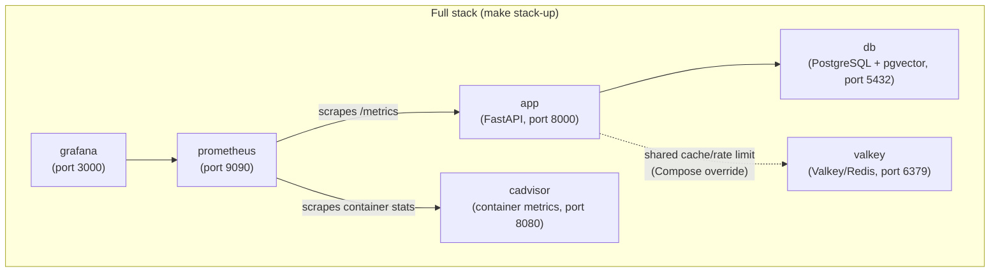

# Docker

## Services



Valkey is always started in Compose and the app/worker containers use it for shared cache/rate limits through Compose overrides. Host-run app processes still fall back to in-memory cache when `VALKEY_HOST` is empty.

## Resource guardrails

Compose applies small-host defaults so local dev and a single-VPS MVP do not run without ceilings:

| Service group | Guardrail | Default intent |
| --- | --- | --- |
| All services | Docker json-file log rotation | `10m` x `3` files per container |
| App + worker | CPU and memory caps | keep runaway requests/idle worker loops bounded |
| PostgreSQL | `max_connections`, `shared_buffers`, `work_mem` | avoid excess per-connection memory on a small VPS |
| Valkey | `maxmemory` + eviction policy | cache/rate-limit store evicts instead of growing until OOM |
| Qdrant | container cap + telemetry disabled | keep Phase 0 idle footprint small |
| Prometheus | TSDB time/size retention | avoid unbounded metrics volume growth |
| Langfuse profile | higher explicit caps | treated as optional/heavy because ClickHouse + web + worker are RAM-heavy |

Tune these values in `.env.<env>`:

```bash
DOCKER_LOG_MAX_SIZE=10m
DOCKER_LOG_MAX_FILE=3
APP_MEM_LIMIT=512m
POSTGRES_MAX_CONNECTIONS=50
VALKEY_MAXMEMORY=192mb
PROMETHEUS_RETENTION_TIME=7d
PROMETHEUS_RETENTION_SIZE=1GB
LANGFUSE_CLICKHOUSE_MEM_LIMIT=2048m
```

For routine development, prefer `make docker-up ENV=development`. Use `make stack-up ENV=development` only when checking Prometheus/Grafana/cAdvisor metrics. Use `make stack-up-langfuse ENV=development` only when the machine has enough RAM headroom; on a tight VPS, prefer Langfuse Cloud until the deployment target is upgraded.

## Commands

### API + database only (most common for development)

```bash
make docker-up ENV=development     # start
make docker-down ENV=development   # stop
make docker-logs ENV=development   # tail logs
```

### Full stack (includes Prometheus + Grafana)

```bash
make stack-up ENV=development      # start everything
make stack-down ENV=development    # stop everything
make stack-logs ENV=development    # tail all service logs
```

### Build a custom image

```bash
make docker-build ENV=production
```

This runs `scripts/build-docker.sh` which builds and tags the image for the specified environment.

## Running migrations inside Docker

After `make docker-up`, run migrations against the containerised database:

```bash
make migrate ENV=development
```

This sources the correct `.env` file and runs `alembic upgrade head` from your local machine, connecting to the containerised PostgreSQL.

## Environment files

Each environment needs a `.env.<env>` file:

```bash
cp .env.example .env.development
cp .env.example .env.staging
cp .env.example .env.production
```

The `docker-up` and `stack-up` commands pass the env file to Docker Compose via `--env-file`. Keep host-run service URLs on published localhost ports, such as `POSTGRES_HOST=localhost`, `QDRANT_URL=http://localhost:6333`, and empty `VALKEY_HOST`; Compose overrides the app/worker container environment to use internal service aliases. For self-host Langfuse in containers, use `LANGFUSE_CONTAINER_HOST=http://langfuse-web:3000`; for Langfuse Cloud in containers, point `LANGFUSE_CONTAINER_HOST` at the cloud URL.

## Grafana

After `make stack-up`, Grafana is available at [http://localhost:3000](http://localhost:3000).

Default credentials: `admin` / `admin`

Pre-configured dashboards (in `grafana/`):

- API performance (request rate, latency, error rate)
- Rate limiting statistics
- Database connection pool health
- System resource usage
