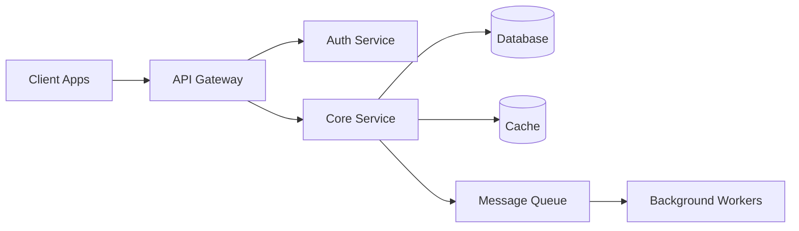

# System Architecture

## Overview

Document the high-level system architecture, components, and their interactions.

## System Context

## Components

### API Layer
- Framework: [Express/Fastify/NestJS/FastAPI/Gin]
- Responsibilities: request routing, validation, response formatting
- Middleware: auth, rate limiting, logging, CORS

### Service Layer
- Business logic and domain rules
- Transaction management
- External service integration
- Event publishing

### Data Layer
- Primary database: [PostgreSQL/MongoDB]
- Cache: [Redis]
- Search: [Elasticsearch] (if applicable)
- File storage: [S3/GCS] (if applicable)

### Infrastructure
- Container runtime: Docker
- Orchestration: [Docker Compose/Kubernetes]
- CI/CD: GitHub Actions
- Monitoring: [Prometheus/Datadog/CloudWatch]

## Data Flow

### Request Lifecycle
1. Client sends HTTP request
2. Load balancer routes to available instance
3. Middleware pipeline: CORS -> Rate Limit -> Auth -> Validation
4. Controller delegates to service layer
5. Service executes business logic
6. Repository handles data persistence
7. Response formatted and returned

### Background Processing
1. Service publishes event to message queue
2. Worker consumes event
3. Worker executes long-running task
4. Result stored or notification sent

## Deployment

### Environments
- Development: local Docker Compose
- Staging: [cloud provider] with production-like config
- Production: [cloud provider] with HA configuration

### Scaling Strategy
- Horizontal scaling for stateless API instances
- Read replicas for database read scaling
- Cache layer for frequently accessed data
- Queue-based processing for async workloads

## Security Architecture

- TLS termination at load balancer
- JWT-based authentication
- Role-based access control (RBAC)
- Network segmentation (public/private subnets)
- Secrets managed via environment variables or secret manager
