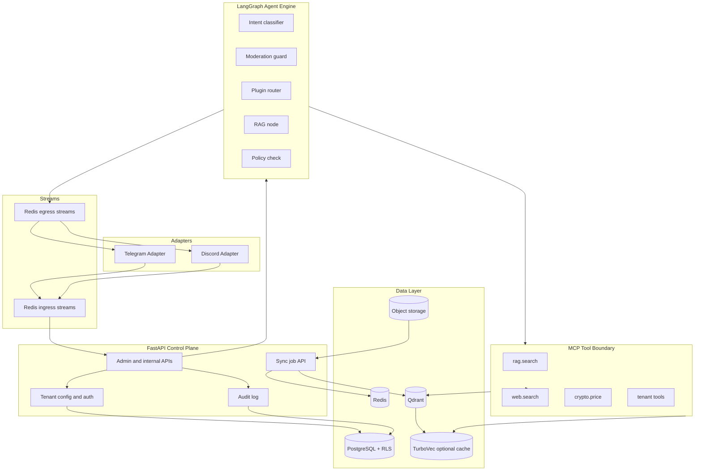

# System Architecture

## Overview

The architecture separates chat ingestion, tenant control, agent execution, plugin execution, and knowledge storage.



## Runtime Components

| Component | Responsibility | Rule |
| --- | --- | --- |
| Telegram adapter | Translate Telegram events into internal envelopes. | No business logic. |
| Discord adapter | Translate Discord events into internal envelopes. | No business logic. |
| FastAPI API | Tenant config, auth, admin actions, internal orchestration. | Owns authorization. |
| Redis Streams | Durable-ish message bus for ingress and egress. | Envelope must include trace id. |
| LangGraph engine | Deterministic agent state machine. | Every node is observable. |
| MCP servers | External capabilities and tool contracts. | No broad tenant access. |
| PostgreSQL | Transactional source of truth. | RLS on tenant-owned tables. |
| Qdrant | Knowledge vector index. | Payload filters are mandatory. |
| TurboVec | Optional local compressed read-path accelerator. | Feature-flagged; rebuildable from durable data. |
| CocoIndex workers | Incremental source sync and indexing. | Jobs are idempotent. |

## Message Envelope

```json
{
  "trace_id": "uuid",
  "tenant_id": "uuid",
  "platform": "telegram",
  "channel_id": "string",
  "thread_id": "string|null",
  "user_id": "string",
  "message_id": "string",
  "text": "string",
  "attachments": [],
  "received_at": "2026-05-28T00:00:00Z"
}
```

## LangGraph State

```python
class AgentState(TypedDict):
    trace_id: str
    tenant_id: str
    platform: str
    channel_id: str
    user_id: str
    messages: list[BaseMessage]
    tenant_config: dict
    enabled_tools: list[str]
    moderation_result: dict | None
    retrieval_context: list[dict]
    tool_results: list[dict]
    final_response: str | None
```

## Data Model

### Required Tables

| Table | Purpose |
| --- | --- |
| `tenants` | Tenant identity, default persona, model config, status. |
| `tenant_platforms` | Connected Telegram/Discord workspaces. |
| `tenant_plugins` | Enabled tools, skills, and sub-agents. |
| `knowledge_sources` | GitBook, URL, Drive, uploads, source config. |
| `sync_jobs` | Source sync attempts, status, counts, error. |
| `chat_events` | Inbound/outbound message events. |
| `agent_runs` | Graph run metadata, latency, model, cost. |
| `tool_calls` | Tool name, input hash, output summary, error. |
| `moderation_actions` | Proposed and executed moderation outcomes. |
| `audit_log` | Admin and system changes. |

Current Phase 1 foundation tables:

- `tenants`: tenant identity, status, display name, validated config JSON, config version.
- `tenant_plugins`: tenant-owned enabled/disabled plugin rows, protected by RLS.
- `audit_log`: platform-admin audit trail for tenant config and plugin mutations.
- `chat_events`: tenant-owned message event baseline from the foundation slice.

Current admin API boundary:

```text
POST   /admin/tenants
GET    /admin/tenants
GET    /admin/tenants/{tenant_id}
PATCH  /admin/tenants/{tenant_id}
PUT    /admin/tenants/{tenant_id}/plugins/{plugin_name}
DELETE /admin/tenants/{tenant_id}/plugins/{plugin_name}
GET    /admin/audit-log
```

Admin routes currently use `X-Admin-Token` as a local placeholder only. They also
preserve or generate `X-Trace-Id` and write mutation audit rows.
Tenant plugin config requests reject credential-like keys before persistence in
this phase, including normalized separator, case, Unicode, and common credential
header-value variants. Tenant plugin responses still redact secret-like config
keys and credential-like string values before returning JSON as a
defense-in-depth guard for legacy or manually seeded data.

### PostgreSQL RLS

Every tenant-owned table must include `tenant_id`.

```sql
ALTER TABLE chat_events ENABLE ROW LEVEL SECURITY;

CREATE POLICY tenant_isolation_chat_events ON chat_events
USING (tenant_id = current_setting('app.current_tenant')::uuid);
```

Application code must set tenant context inside a transaction:

```sql
SELECT set_config('app.current_tenant', :tenant_id, true);
```

Platform-admin routes use a privileged admin session behind admin auth and audit.
Tenant-runtime paths use the app role plus `app.current_tenant`.

## Vector Layout

Default collection:

- `knowledge_chunks_v1`

Required payload:

```json
{
  "tenant_id": "uuid",
  "source_id": "uuid",
  "document_id": "uuid",
  "chunk_id": "uuid",
  "visibility": "public|private|internal",
  "source_url": "https://docs.example.com/page",
  "source_version": "hash",
  "updated_at": "2026-05-28T00:00:00Z"
}
```

Dedicated tenant collections are allowed only when one of these is true:

- Enterprise isolation requirement.
- Tenant has enough volume to justify operational overhead.
- Tenant uses a separate embedding model or retention policy.

## TurboVec Accelerator

TurboVec is not the source of truth. It can be added after the Qdrant provider works and only behind `RAG_ACCELERATOR=turbovec`.

Runtime contract:

- Qdrant stores durable embeddings, payload, and citation metadata.
- TurboVec stores a rebuildable local compressed index.
- Tenant/source ACL resolution happens before or inside provider query.
- Query output shape must match the Qdrant provider.
- Corrupt, stale, or missing TurboVec indexes must fall back to Qdrant or fail closed.

## Security Boundaries

- Adapters cannot read tenant secrets.
- MCP tools receive scoped credentials, not platform-wide credentials.
- Tenant plugin config must not store raw credentials; future credential material
  belongs in a secrets manager or encrypted credential table with scoped handles.
- `AGENT_SUPPORT_ADMIN_TOKEN=local-admin-token` is accepted only for local
  environment defaults; staging/production settings must override it.
- Tool output is untrusted until normalized and policy-checked.
- All destructive moderation actions require policy config and audit logging.
- Prompt templates are tenant data and must be validated before execution.

## Observability

Every run must emit:

- `trace_id`
- `tenant_id`
- graph node latencies
- model provider/model
- token usage and estimated cost
- retrieval hit count and source ids
- tool call count and errors
- moderation decision
- final action type
