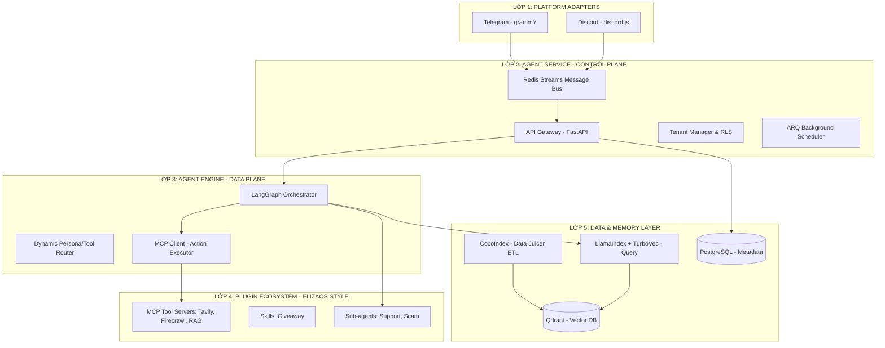
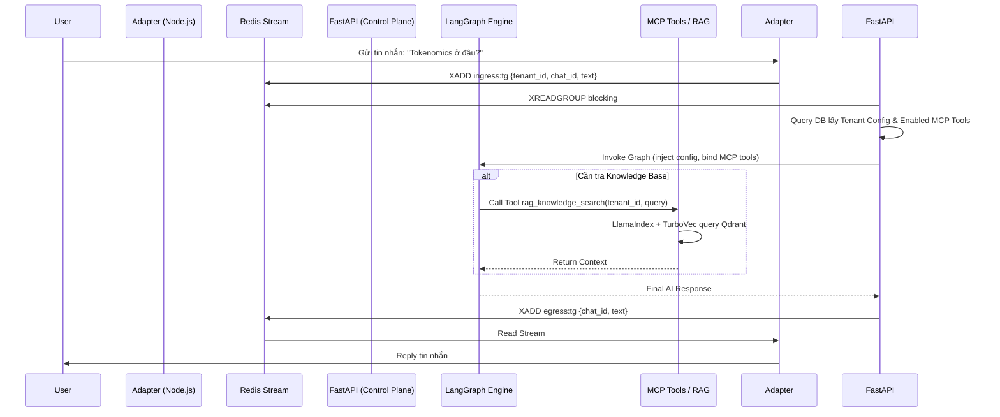

Dưới đây là Bản Đặc tả Kỹ thuật & Sản phẩm (Technical & Product Specification Document) tổng hợp toàn bộ, được định dạng chuẩn theo kiểu Enterprise SaaS, chi tiết từ luồng dữ liệu, cấu trúc DB, cho đến code snippet cốt lõi. Đây là tài liệu "Source of Truth" để bắt tay vào code.

---

# CRYPTO AGENT PLATFORM - MASTER TECHNICAL SPECIFICATION
**Document Version:** 1.0 (Production Blueprint)  
**Architecture Paradigms:** AgentScope 2.0 (Layered), ElizaOS (Plug-and-play), Event-Driven Multi-tenant  

---

## 1. PRODUCT OVERVIEW (PRD)

### 1.1. Tầm nhìn
Xây dựng nền tảng SaaS B2B cung cấp AI Agent tự động hóa vận hành cộng đồng Crypto (Telegram, Discord). Agent hoạt động 24/7 như một Moderator + Community Manager + Support Assistant, với khả năng mở rộng tính năng bằng cách cắm-tháo Sub-agents, Skills và Tools (Chuẩn MCP) như ElizaOS.

### 1.2. Vấn đề & Giải pháp
- **Vấn đề:** Mod không trực 24/7, FAQ lặp lại, rủi ro scam cao, chi phí nhân sự scale nhanh, Knowledge Base hay bị lỗi thời.
- **Giải pháp:** 
  - **Data Freshness:** CocoIndex đồng bộ dữ liệu (Delta ETL) liên tục.
  - **Low Latency:** LlamaIndex + TurboVec tối ưu truy xuất RAG (< 2s).
  - **Modularity:** Kiến trúc MCP cho phép bật/tắt Tools, Sub-agents linh hoạt qua Dashboard.

### 1.3. Core Features (MVP)
1. **Smart Support (RAG):** Trả lời FAQ dựa trên Docs/Whitepaper.
2. **Scam/Toxic Detection:** Nhận diện link độc, tự động xóa/ban.
3. **Auto Onboarding:** Chào hội viên mới.
4. **Plug-and-Play Tools:** Tra giá token, Search Web (MCP).
5. **Knowledge Sync:** Đồng bộ Gitbook/Drive tự động qua CocoIndex.

---

## 2. SYSTEM ARCHITECTURE (LAYERED DESIGN)

Thiết kế tham chiếu trực tiếp từ AgentScope 2.0, tách biệt **Control Plane** (Vận hành) và **Data Plane** (Xử lý AI).



---

## 3. TECH STACK MATRIX

| Lớp | Thành phần | Công nghệ / Library |
| :--- | :--- | :--- |
| **Ingress** | Telegram, Discord | `Node.js`, `grammY`, `discord.js` |
| **Control Plane** | API, Queue, Scheduler | `Python`, `FastAPI`, `ARQ`, `Redis Streams`, `SQLModel` |
| **Data Plane** | Orchestrator, ReAct Loop | `LangGraph`, `LangChain Core` |
| **Ecosystem** | Tool Calling Protocol | `MCP (Model Context Protocol) SDK` |
| **AI Models** | Chat, Embedding | `LiteLLM` (Grok/OpenAI/Claude), `Cohere/BGE` |
| **Read Path (RAG)** | Fast Retrieval | `LlamaIndex`, **`TurboVec`**, `Cohere Rerank` |
| **Write Path (ETL)** | Incremental Sync | **`CocoIndex`** |
| **Vector DB** | Isolated Collections | `Qdrant` |
| **Relational DB** | Metadata, Billing | `PostgreSQL` (Row-Level Security) |
| **Observability** | Tracing, Eval | `Langfuse`, Shadow Mode |

---

## 4. DEEP-DIVE: DATA FLOWS

### 4.1. Ingress Chat Flow (Xử lý tin nhắn)


### 4.2. Knowledge Sync Flow (Write Path)
1. Admin bấm "Sync Gitbook" trên Dashboard -> Call API `POST /v1/tenants/{id}/sync`.
2. FastAPI đẩy job vào ARQ Background Worker.
3. ARQ Worker khởi chạy CocoIndex Flow riêng của Tenant đó.
4. CocoIndex: Crawl URL -> Parse HTML -> Chunk -> Embed -> UPSERT vào Qdrant.

---

## 5. DEEP-DIVE: DATABASE & STORAGE SCHEMA

### 5.1. PostgreSQL (Multi-tenant Row-Level Security)
Áp dụng RLS để đảm bảo cách ly dữ liệu ở cấp độ Database.

**Bảng `tenants`**
| Column | Type | Description |
| :--- | :--- | :--- |
| id | UUID | Primary Key |
| name | VARCHAR | Tên dự án |
| default_persona | TEXT | System Prompt mặc định (hỗ trợ Jinja2) |
| llm_config | JSONB | `{"model": "gpt-4o", "temp": 0.3}` |
| qdrant_collection | VARCHAR | Tên collection VD: `tenant_projA_vectors` |

**Bảng `tenant_plugins` (Cơ chế ElizaOS Plug-and-play)**
| Column | Type | Description |
| :--- | :--- | :--- |
| id | UUID | PK |
| tenant_id | UUID | FK -> tenants.id |
| plugin_type | ENUM | `sub_agent`, `tool`, `skill` |
| plugin_key | VARCHAR | Định danh VD: `mcp_tavily_search`, `sub_scam_detector` |
| config | JSONB | Cấu hình riêng của plugin |
| is_enabled | BOOLEAN | Bật/tắt động |

**RLS Policy Implementation:**
```sql
ALTER TABLE chat_history ENABLE ROW LEVEL SECURITY;
CREATE POLICY tenant_isolation_policy ON chat_history
    USING (tenant_id = current_setting('app.current_tenant')::UUID);
```

### 5.2. Qdrant Vector DB (Isolated Collections)
Mỗi Tenant 1 Collection để tối ưu hiệu năng tìm kiếm (không filter payload chéo).
- **Collection Name:** `tenant_{tenant_id}_vectors`
- **Payload Structure:**
  ```json
  {
    "doc_id": "uuid",
    "chunk_id": "uuid",
    "text": "Nội dung chunk...",
    "source_url": "https://docs.project.com/tokenomics",
    "last_updated": "2026-05-28T10:00:00Z"
  }
  ```

---

## 6. DEEP-DIVE: AI ENGINE & RAG IMPLEMENTATION

### 6.1. LangGraph Dynamic Tool Binding (ElizaOS Mechanism)
Trước khi Invoke Graph, Control Plane thực hiện Dynamic Binding:
1. Query bảng `tenant_plugins` WHERE `is_enabled = True`.
2. Khởi tạo MCP Client, truyền vào danh sách Server cần kết nối.
3. Lấy schema Tools từ MCP Servers.
4. Inject Tools vào `llm.bind_tools(tools)` của LangGraph node.

**Code Logic (Orchestrator Router):**
```python
class AgentState(TypedDict):
    messages: Annotated[Sequence[BaseMessage], "messages"]
    tenant_id: str
    config: dict 

def route_to_subagent(state: AgentState) -> str:
    last_msg = state["messages"][-1].content.lower()
    enabled_plugins = state["config"]["enabled_plugins"]
    
    if "http" in last_msg and "sub_scam_detector" in enabled_plugins:
        return "scam_detector"
    return "support_agent"
```

### 6.2. RAG Write Path: CocoIndex (Data-Juicer)
Đồng bộ incremental, chỉ xử lý Delta (phần thay đổi).
```python
import cocoindex

@app.flow(name=f"tenant_{tenant_id}_sync")
def sync_gitbook():
    docs = cocoindex.sources.Web(url="https://docs.proj.com")
    chunks = cocoindex.ops.SplitRecursively(docs, chunk_size=512)
    embeddings = cocoindex.ops.Embed(chunks, model="openai-ada-002")
    cocoindex.sinks.Qdrant(embeddings, collection=f"tenant_{tenant_id}_vectors")
```

### 6.3. RAG Read Path: LlamaIndex + TurboVec (High-Speed Retrieval)
Đóng gói thành 1 MCP Server, Agent gọi khi cần context.
```python
from llama_index.core import VectorStoreIndex
from llama_index.vector_stores.turbovec import TurboVecVectorStore

def query_knowledge(tenant_id: str, query_str: str):
    vector_store = TurboVecVectorStore(
        collection_name=f"tenant_{tenant_id}_vectors",
        url=os.getenv("QDRANT_URL")
    )
    index = VectorStoreIndex.from_vector_store(vector_store)
    
    query_engine = index.as_query_engine(
        similarity_top_k=10,
        node_postprocessors=[CohereRerank(top_n=3)]
    )
    response = query_engine.query(query_str)
    return str(response)
```

---

## 7. PROJECT STRUCTURE (MONOREPO)

```text
crypto-agent-platform/
│
├── adapters/                     # LỚP 1: Node.js Ingress
│   ├── telegram-bot/             # grammY adapter
│   └── discord-bot/              # discord.js adapter
│
├── core/                         # LỚP 2 & 3: Python Control & Data Plane
│   ├── api/                      # FastAPI (Control Plane)
│   │   ├── main.py               # App entrypoint, RLS middleware
│   │   └── routers/              # Tenant, Chat, Sync endpoints
│   │
│   ├── engine/                   # LangGraph (Data Plane)
│   │   ├── orchestrator.py       # StateGraph chính & Router
│   │   ├── dynamic_loader.py     # MCP Client & bind_tools logic
│   │   └── state_schemas.py      # Pydantic AgentState
│   │
│   ├── agents/                   # Sub-agents (QwenPaw Prompt Structure)
│   │   ├── support_agent/        
│   │   │   ├── graph.py          
│   │   │   └── prompts.py        # Jinja2 System Prompts
│   │   └── scam_detector/        
│
├── mcp_servers/                  # LỚP 4: Hệ sinh thái Tools (Chuẩn MCP)
│   ├── server_rag_query/         # Bọc LlamaIndex+TurboVec
│   ├── server_web_search/        # Tavily Search
│   └── server_crypto_data/       # DexScreener API
│
├── data_plane/                   # LỚP 5: ETL & DB Migrations
│   ├── etl_cocoindex/            # CocoIndex flows & triggers
│   └── db/                       # SQLModel schemas & Alembic
│
├── infra/                        # DevOps
│   └── docker-compose.yml        # Postgres, Redis, Qdrant
│
└── pyproject.toml                # Python dependencies
```

---
